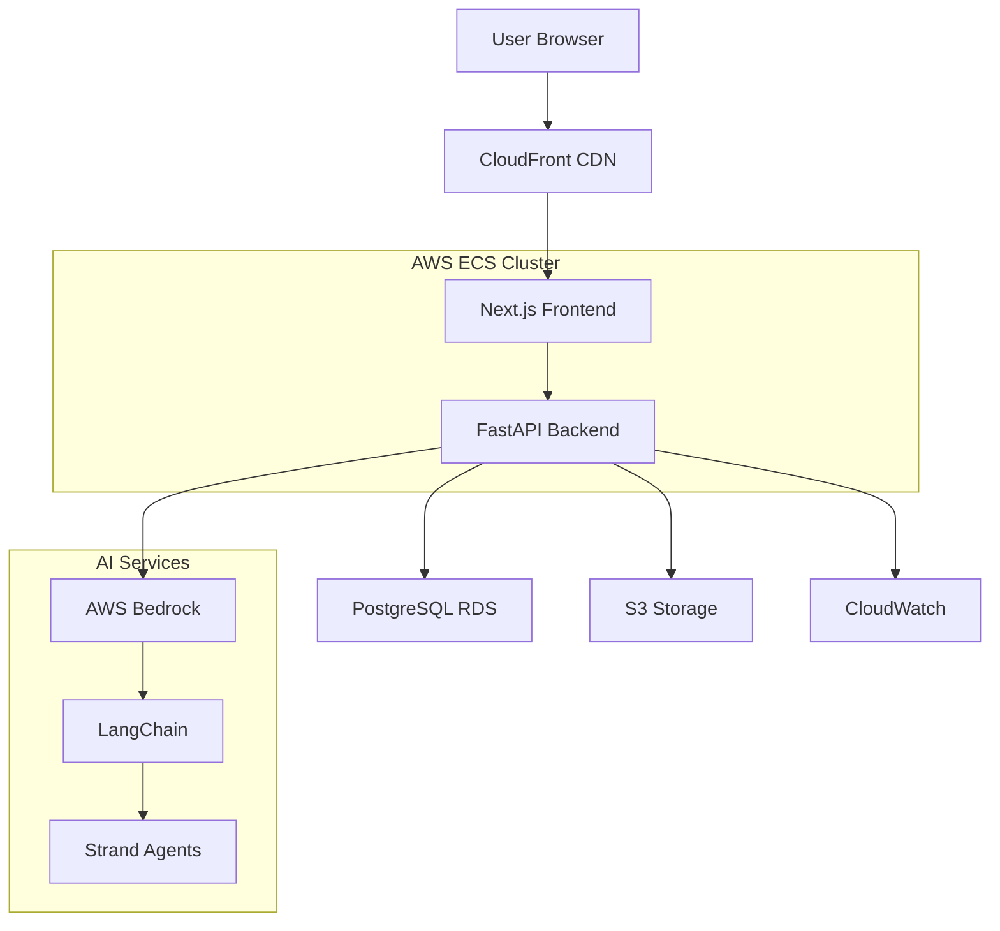
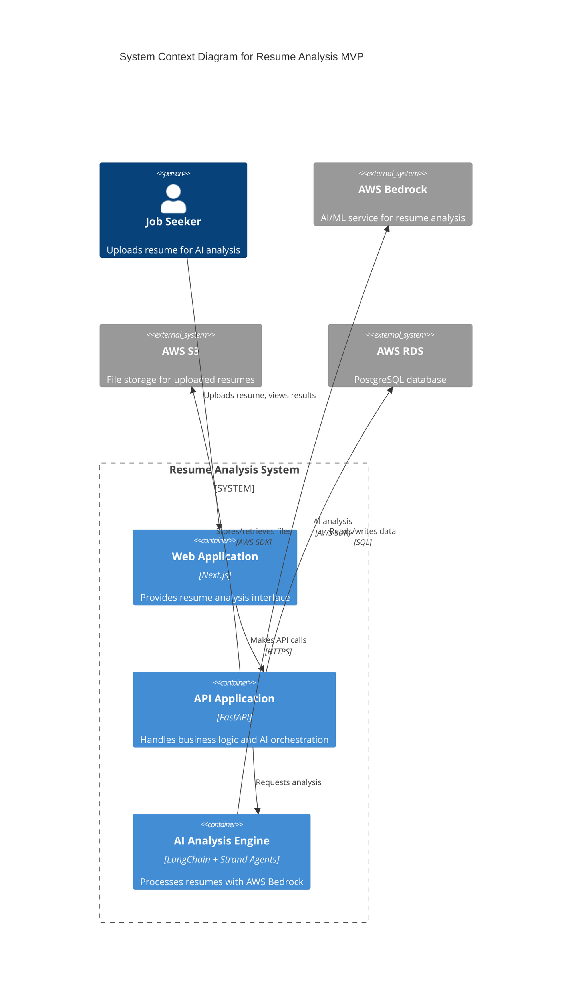
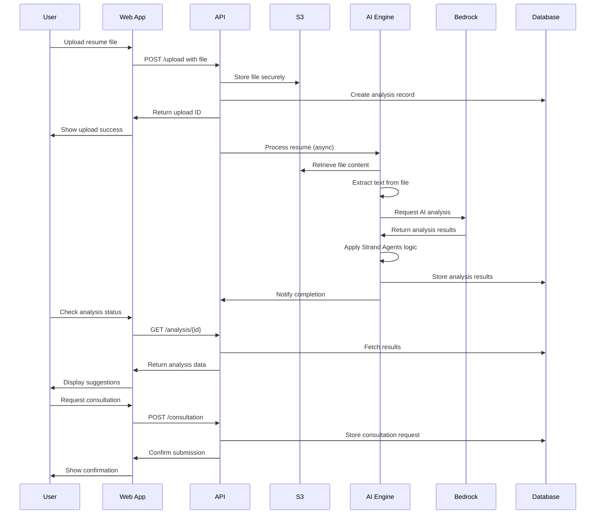

# Resume Analysis MVP Fullstack Architecture Document

*Generated using BMAD™ Core Architecture Template v2.0*

---

## Introduction

This document outlines the complete fullstack architecture for Resume Analysis MVP, including backend systems, frontend implementation, and their integration. It serves as the single source of truth for AI-driven development, ensuring consistency across the entire technology stack.

This unified approach combines what would traditionally be separate backend and frontend architecture documents, streamlining the development process for modern fullstack applications where these concerns are increasingly intertwined.

### Starter Template or Existing Project

N/A - Greenfield project

### Change Log

| Date | Version | Description | Author |
|------|---------|-------------|---------|
| 2024-12-19 | 1.0 | Initial architecture creation from PRD | Winston (Architect) |
| 2024-09-11 | 1.1 | Added Clerk authentication architecture | Winston (Architect) |

### Related Architecture Documents

- **[Clerk Authentication Architecture](architecture/clerk-authentication-architecture.md)** - Complete Clerk integration design for Phase 2 user authentication

---

## High Level Architecture

### Technical Summary

The Resume Analysis MVP employs a modern fullstack architecture using Next.js for the frontend and Python FastAPI for the backend, deployed as a unified Docker container on AWS ECS. The system leverages AWS Bedrock for AI-powered resume analysis, enhanced with LangChain for workflow orchestration and Strand Agents for autonomous decision-making. The architecture supports a freemium model with no authentication required in Phase 1, enabling immediate user access while maintaining scalability for future premium features.

### Platform and Infrastructure Choice

**Platform:** AWS
**Key Services:** ECS, S3, RDS PostgreSQL, Bedrock, CloudWatch
**Deployment Host and Regions:** us-east-1 (primary), us-west-2 (backup)

**Rationale:** AWS provides comprehensive AI services with Bedrock, robust container orchestration with ECS, and cost-effective scaling options suitable for MVP deployment.

### Repository Structure

**Structure:** Monorepo
**Monorepo Tool:** npm workspaces
**Package Organization:** Frontend (apps/web), Backend (apps/api), Shared types/utilities (packages/shared)

### High Level Architecture Diagram



### Architectural Patterns

- **Jamstack Architecture:** Static site generation with serverless APIs - _Rationale:_ Optimal performance and scalability for content-heavy applications
- **Component-Based UI:** Reusable React components with TypeScript - _Rationale:_ Maintainability and type safety across large codebases
- **Repository Pattern:** Abstract data access logic - _Rationale:_ Enables testing and future database migration flexibility
- **API Gateway Pattern:** Single entry point for all API calls - _Rationale:_ Centralized auth, rate limiting, and monitoring
- **Agentic AI Pattern:** Autonomous AI agents for decision-making - _Rationale:_ Enables intelligent, context-aware resume analysis

---

## Tech Stack

### Technology Stack Table

| Category | Technology | Version | Purpose | Rationale |
|----------|------------|---------|---------|-----------|
| Frontend Language | TypeScript | ^5.0 | Type-safe development | Prevents runtime errors, improves DX |
| Frontend Framework | Next.js | ^14.0 | Full-stack React framework | SSR, API routes, optimized builds |
| UI Component Library | Tailwind CSS + Headless UI | ^3.0 | Utility-first CSS framework | Rapid development, consistent design |
| State Management | Zustand | ^4.0 | Lightweight state management | Simple API, TypeScript support |
| Backend Language | Python | ^3.11 | High-level programming | AI/ML ecosystem, FastAPI compatibility |
| Backend Framework | FastAPI | ^0.104 | Modern Python API framework | Automatic docs, async support, performance |
| API Style | REST | OpenAPI 3.0 | RESTful API design | Standard, well-documented approach |
| Database | PostgreSQL | ^15.0 | Relational database | ACID compliance, JSON support |
| Cache | Redis | ^7.0 | In-memory data store | Session storage, caching |
| File Storage | AWS S3 | Latest | Object storage | Scalable, secure file storage |
| Authentication | Clerk | ^4.0 | User authentication service | Easy integration, multiple providers |
| Frontend Testing | Jest + React Testing Library | ^29.0 | Unit testing framework | React-focused testing utilities |
| Backend Testing | Pytest | ^7.0 | Python testing framework | Comprehensive testing features |
| E2E Testing | Playwright | ^1.40 | End-to-end testing | Cross-browser automation |
| Build Tool | npm | ^10.0 | Package management | Standard Node.js tool |
| Bundler | Next.js built-in | ^14.0 | Module bundling | Optimized for React/Next.js |
| IaC Tool | AWS CDK | ^2.0 | Infrastructure as Code | Type-safe infrastructure |
| CI/CD | GitHub Actions | Latest | Continuous integration | Git-integrated workflows |
| Monitoring | AWS CloudWatch | Latest | Application monitoring | Native AWS integration |
| Logging | Winston | ^3.0 | Structured logging | Flexible logging library |
| CSS Framework | Tailwind CSS | ^3.0 | Utility-first CSS | Rapid styling, consistent design |

---

## Data Models

### User

**Purpose:** Represents job seekers using the resume analysis service

**Key Attributes:**
- id: string - Unique identifier
- email: string - User email address
- createdAt: Date - Account creation timestamp
- lastAnalysis: Date - Last resume analysis date

#### TypeScript Interface

```typescript
interface User {
  id: string;
  email: string;
  createdAt: Date;
  updatedAt: Date;
  lastAnalysis?: Date;
  analysisCount: number;
}
```

#### Relationships
- One-to-many with ResumeAnalysis
- One-to-many with ConsultationRequest

### ResumeAnalysis

**Purpose:** Stores resume analysis results and improvement suggestions

**Key Attributes:**
- id: string - Unique analysis identifier
- userId: string - Associated user ID
- originalContent: string - Extracted resume text
- analysisResults: object - AI analysis results
- score: number - Overall ATS compatibility score

#### TypeScript Interface

```typescript
interface ResumeAnalysis {
  id: string;
  userId?: string;
  sessionId: string;
  originalFileName: string;
  s3Key: string;
  extractedText: string;
  analysisResults: {
    overallScore: number;
    atsCompatibility: ATSAnalysis;
    keywordOptimization: KeywordAnalysis;
    structureAnalysis: StructureAnalysis;
    suggestions: Suggestion[];
  };
  createdAt: Date;
  status: 'processing' | 'completed' | 'failed';
}
```

#### Relationships
- Many-to-one with User
- One-to-many with ConsultationRequest

### ConsultationRequest

**Purpose:** Captures user requests for expert consultation services

**Key Attributes:**
- id: string - Unique request identifier
- email: string - User contact email
- helpCategory: string - Type of help requested
- details: string - Specific needs description
- analysisId: string - Related resume analysis

#### TypeScript Interface

```typescript
interface ConsultationRequest {
  id: string;
  email: string;
  helpCategory: 'resume_review' | 'career_strategy' | 'interview_prep';
  details: string;
  analysisId: string;
  status: 'pending' | 'contacted' | 'completed';
  createdAt: Date;
  priority: 'low' | 'medium' | 'high';
}
```

#### Relationships
- Many-to-one with User
- Many-to-one with ResumeAnalysis

---

## API Specification

### REST API Specification

```yaml
openapi: 3.0.0
info:
  title: Resume Analysis API
  version: 1.0.0
  description: API for AI-powered resume analysis and consultation requests
servers:
  - url: https://api.resumeanalysis.com/v1
    description: Production server
  - url: http://localhost:3000/api
    description: Development server

paths:
  /upload:
    post:
      summary: Upload resume for analysis
      requestBody:
        content:
          multipart/form-data:
            schema:
              type: object
              properties:
                file:
                  type: string
                  format: binary
                sessionId:
                  type: string
      responses:
        '200':
          description: Upload successful
          content:
            application/json:
              schema:
                type: object
                properties:
                  uploadId: 
                    type: string
                  status:
                    type: string

  /analysis/{uploadId}:
    get:
      summary: Get analysis results
      parameters:
        - name: uploadId
          in: path
          required: true
          schema:
            type: string
      responses:
        '200':
          description: Analysis results
          content:
            application/json:
              schema:
                $ref: '#/components/schemas/AnalysisResult'

  /consultation:
    post:
      summary: Submit consultation request
      requestBody:
        required: true
        content:
          application/json:
            schema:
              $ref: '#/components/schemas/ConsultationRequest'
      responses:
        '201':
          description: Request submitted successfully

components:
  schemas:
    AnalysisResult:
      type: object
      properties:
        id:
          type: string
        overallScore:
          type: number
        suggestions:
          type: array
          items:
            $ref: '#/components/schemas/Suggestion'
        
    Suggestion:
      type: object
      properties:
        category:
          type: string
        priority:
          type: string
        description:
          type: string
        example:
          type: string
        
    ConsultationRequest:
      type: object
      required:
        - email
        - helpCategory
        - details
      properties:
        email:
          type: string
          format: email
        helpCategory:
          type: string
          enum: [resume_review, career_strategy, interview_prep]
        details:
          type: string
        analysisId:
          type: string
```

---

## Components

### Frontend Application

**Responsibility:** User interface for resume upload, analysis display, and consultation requests

**Key Interfaces:**
- React components for multi-step wizard
- API client for backend communication
- State management for user session

**Dependencies:** Backend API, AWS S3 for file upload

**Technology Stack:** Next.js 14, TypeScript, Tailwind CSS, Zustand

### Backend API

**Responsibility:** Handle file uploads, orchestrate AI analysis, manage data persistence

**Key Interfaces:**
- REST API endpoints
- File processing pipeline
- AI service integration

**Dependencies:** AWS Bedrock, PostgreSQL, S3

**Technology Stack:** Python FastAPI, SQLAlchemy, Boto3

### AI Analysis Engine

**Responsibility:** Process resumes using AWS Bedrock and provide intelligent suggestions

**Key Interfaces:**
- LangChain workflow orchestration
- Strand Agents for autonomous decisions
- Resume content extraction and analysis

**Dependencies:** AWS Bedrock, LangChain, Strand Agents

**Technology Stack:** Python, LangChain, Strand Agents, AWS Bedrock

### File Processing Service

**Responsibility:** Extract text from uploaded resume files (PDF, DOC, TXT)

**Key Interfaces:**
- File format detection
- Text extraction APIs
- Content validation

**Dependencies:** AWS S3, text extraction libraries

**Technology Stack:** Python, PyPDF2, python-docx, boto3

### Database Layer

**Responsibility:** Data persistence and retrieval for users, analyses, and consultation requests

**Key Interfaces:**
- SQLAlchemy ORM models
- Database migrations
- Query optimization

**Dependencies:** PostgreSQL RDS

**Technology Stack:** SQLAlchemy, Alembic, PostgreSQL

### Component Diagrams



---

## External APIs

### AWS Bedrock API

- **Purpose:** AI-powered resume analysis and improvement suggestions
- **Documentation:** https://docs.aws.amazon.com/bedrock/
- **Base URL(s):** https://bedrock-runtime.{region}.amazonaws.com
- **Authentication:** AWS IAM roles and policies
- **Rate Limits:** Model-specific limits, typically 1000 requests/minute

**Key Endpoints Used:**
- `POST /model/{modelId}/invoke` - Invoke AI model for analysis

**Integration Notes:** Used through LangChain abstractions with Strand Agents for autonomous decision-making

### AWS S3 API

- **Purpose:** Secure file storage for uploaded resumes
- **Documentation:** https://docs.aws.amazon.com/s3/
- **Base URL(s):** https://s3.{region}.amazonaws.com
- **Authentication:** AWS IAM roles and policies
- **Rate Limits:** 3500 PUT/COPY/POST/DELETE and 5500 GET/HEAD requests per second

**Key Endpoints Used:**
- `PUT /{bucket}/{key}` - Upload resume files
- `GET /{bucket}/{key}` - Retrieve resume files for processing

**Integration Notes:** Files are encrypted at rest and have 30-day retention policy for GDPR compliance

---

## Core Workflows



---

## Database Schema

```sql
-- Users table (Phase 2)
CREATE TABLE users (
    id UUID PRIMARY KEY DEFAULT gen_random_uuid(),
    email VARCHAR(255) UNIQUE NOT NULL,
    created_at TIMESTAMP WITH TIME ZONE DEFAULT NOW(),
    updated_at TIMESTAMP WITH TIME ZONE DEFAULT NOW(),
    last_analysis TIMESTAMP WITH TIME ZONE,
    analysis_count INTEGER DEFAULT 0
);

-- Resume analyses table
CREATE TABLE resume_analyses (
    id UUID PRIMARY KEY DEFAULT gen_random_uuid(),
    user_id UUID REFERENCES users(id) ON DELETE SET NULL,
    session_id VARCHAR(255) NOT NULL,
    original_filename VARCHAR(255) NOT NULL,
    s3_key VARCHAR(512) NOT NULL,
    extracted_text TEXT,
    analysis_results JSONB,
    overall_score DECIMAL(3,1),
    status VARCHAR(20) DEFAULT 'processing',
    created_at TIMESTAMP WITH TIME ZONE DEFAULT NOW(),
    updated_at TIMESTAMP WITH TIME ZONE DEFAULT NOW()
);

-- Consultation requests table
CREATE TABLE consultation_requests (
    id UUID PRIMARY KEY DEFAULT gen_random_uuid(),
    email VARCHAR(255) NOT NULL,
    help_category VARCHAR(50) NOT NULL CHECK (help_category IN ('resume_review', 'career_strategy', 'interview_prep')),
    details TEXT NOT NULL,
    analysis_id UUID REFERENCES resume_analyses(id) ON DELETE CASCADE,
    status VARCHAR(20) DEFAULT 'pending',
    priority VARCHAR(10) DEFAULT 'medium',
    created_at TIMESTAMP WITH TIME ZONE DEFAULT NOW(),
    contacted_at TIMESTAMP WITH TIME ZONE,
    completed_at TIMESTAMP WITH TIME ZONE
);

-- Indexes for performance
CREATE INDEX idx_resume_analyses_session_id ON resume_analyses(session_id);
CREATE INDEX idx_resume_analyses_created_at ON resume_analyses(created_at);
CREATE INDEX idx_consultation_requests_status ON consultation_requests(status);
CREATE INDEX idx_consultation_requests_created_at ON consultation_requests(created_at);

-- Data retention policy (30 days for resumes)
CREATE OR REPLACE FUNCTION cleanup_old_analyses() RETURNS void AS $$
BEGIN
    DELETE FROM resume_analyses 
    WHERE created_at < NOW() - INTERVAL '30 days';
END;
$$ LANGUAGE plpgsql;

-- Schedule cleanup (would be handled by application or cron job)
```

---

## Frontend Architecture

### Component Architecture

#### Component Organization

```
src/
├── components/
│   ├── ui/                     # Reusable UI components
│   │   ├── Button.tsx
│   │   ├── Input.tsx
│   │   ├── Modal.tsx
│   │   └── ProgressBar.tsx
│   ├── layout/                 # Layout components
│   │   ├── Header.tsx
│   │   ├── Footer.tsx
│   │   └── Layout.tsx
│   ├── forms/                  # Form components
│   │   ├── FileUpload.tsx
│   │   ├── ConsultationForm.tsx
│   │   └── FeedbackForm.tsx
│   └── analysis/               # Analysis-specific components
│       ├── AnalysisProgress.tsx
│       ├── ResultsDisplay.tsx
│       └── SuggestionCard.tsx
├── pages/                      # Next.js pages
├── hooks/                      # Custom React hooks
├── services/                   # API client services
├── stores/                     # State management
├── styles/                     # Global styles
└── utils/                      # Frontend utilities
```

#### Component Template

```typescript
import React from 'react';
import { cn } from '@/utils/cn';

interface ComponentProps {
  className?: string;
  children?: React.ReactNode;
}

export const Component: React.FC<ComponentProps> = ({
  className,
  children,
  ...props
}) => {
  return (
    <div className={cn('base-styles', className)} {...props}>
      {children}
    </div>
  );
};

Component.displayName = 'Component';
```

### State Management Architecture

#### State Structure

```typescript
interface AppState {
  // Upload state
  upload: {
    file: File | null;
    uploadId: string | null;
    progress: number;
    status: 'idle' | 'uploading' | 'processing' | 'completed' | 'error';
  };
  
  // Analysis state
  analysis: {
    results: AnalysisResult | null;
    loading: boolean;
    error: string | null;
  };
  
  // User session state
  session: {
    sessionId: string;
    email: string | null;
    currentStep: number;
  };
  
  // UI state
  ui: {
    isModalOpen: boolean;
    theme: 'light' | 'dark';
    notifications: Notification[];
  };
}
```

#### State Management Patterns

- **Zustand stores for global state management**
- **React Query for server state synchronization**
- **Local state with useState for component-specific data**
- **Context API for theme and user preferences**

### Routing Architecture

#### Route Organization

```
pages/
├── index.tsx                   # Landing page
├── upload.tsx                  # File upload step
├── analysis.tsx                # Analysis progress and results
├── consultation.tsx            # Consultation request form
├── thank-you.tsx              # Confirmation page
└── api/                       # API routes
    ├── upload.ts
    ├── analysis/
    │   └── [id].ts
    └── consultation.ts
```

#### Protected Route Pattern

```typescript
import { useRouter } from 'next/router';
import { useEffect } from 'react';
import { useSessionStore } from '@/stores/session';

interface ProtectedRouteProps {
  children: React.ReactNode;
  requiresUpload?: boolean;
}

export const ProtectedRoute: React.FC<ProtectedRouteProps> = ({
  children,
  requiresUpload = false
}) => {
  const router = useRouter();
  const { sessionId, uploadId } = useSessionStore();
  
  useEffect(() => {
    if (!sessionId) {
      router.push('/');
      return;
    }
    
    if (requiresUpload && !uploadId) {
      router.push('/upload');
      return;
    }
  }, [sessionId, uploadId, requiresUpload, router]);
  
  return <>{children}</>;
};
```

### Frontend Services Layer

#### API Client Setup

```typescript
import axios from 'axios';
import { useSessionStore } from '@/stores/session';

const api = axios.create({
  baseURL: process.env.NEXT_PUBLIC_API_URL || '/api',
  timeout: 30000,
});

// Request interceptor to add session ID
api.interceptors.request.use((config) => {
  const { sessionId } = useSessionStore.getState();
  if (sessionId) {
    config.headers['X-Session-ID'] = sessionId;
  }
  return config;
});

// Response interceptor for error handling
api.interceptors.response.use(
  (response) => response,
  (error) => {
    // Handle common errors
    if (error.response?.status === 401) {
      // Handle unauthorized
    }
    return Promise.reject(error);
  }
);

export default api;
```

#### Service Example

```typescript
import api from './api-client';
import { AnalysisResult, ConsultationRequest } from '@/types';

export class AnalysisService {
  static async uploadResume(file: File, sessionId: string): Promise<{ uploadId: string }> {
    const formData = new FormData();
    formData.append('file', file);
    formData.append('sessionId', sessionId);
    
    const response = await api.post('/upload', formData, {
      headers: {
        'Content-Type': 'multipart/form-data',
      },
    });
    
    return response.data;
  }
  
  static async getAnalysisResults(uploadId: string): Promise<AnalysisResult> {
    const response = await api.get(`/analysis/${uploadId}`);
    return response.data;
  }
  
  static async submitConsultationRequest(request: ConsultationRequest): Promise<void> {
    await api.post('/consultation', request);
  }
}
```

---

This completes the first part of the architecture document. Due to length constraints, I'll continue with the backend architecture and remaining sections in the next response. Would you like me to continue with the backend architecture section?
